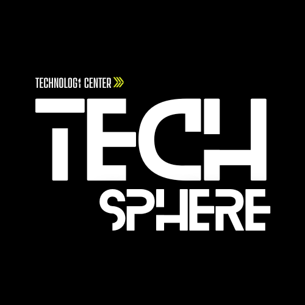

# 🚀 TechSphere



## 🛠️ Tech Stack

- **Frontend**: React, Tailwind CSS, Material UI, Material Tailwind
- **Backend**: Strapi

## 🔧 Installation & Setup

### **Prerequisites**

Ensure you have the following installed:

- Node.js (>= 20)
- npm

### **Frontend**

```bash
cd frontend
npm install
```

### **Backend**

```bash
cd ../backend
npm install
```

### **Run the Application**

#### **Start Backend (Strapi API)**

```bash
cd backend
nvm use 20
npm run develop
```

#### **Start Frontend (React App)**

```bash
cd frontend
nvm use 20
npm start
```

## 📂 Project Structure

```
techsphere/
│── backend/         # Strapi Backend
│── frontend/        # React Frontend
```

## รายละเอียดโครงการ

โครงการพัฒนาระบบ TechSphere เป็นโครงการที่มีวัตถุประสงค์หลักในการสร้างเว็บไซต์ เพื่อการเรียนรู้ออนไลน์ที่สามารถตอบสนองความต้องการของกลุ่มผู้เรียนที่หลากหลายระบบจะถูกพัฒนาโดยใช้เทคโนโลยีที่ทันสมัย เช่น React และ MySQL เพื่อให้การทำงานมีประสิทธิภาพและเสถียร นอกจากนี้ยังมุ่งเน้นการนำเสนอคอร์สเรียนที่ครอบคลุมทั้งพื้นฐาน ระดับกลาง และขั้นสูง โดยมีการออกแบบเนื้อหาให้สอดคล้องกับทักษะที่จำเป็นในโลกดิจิทัลยุคปัจจุบัน ระบบจะรองรับการชำระเงินผ่าน PromptPay เพื่อความสะดวกและรวดเร็ว รวมถึงมีการรายงานความคืบหน้าอย่างต่อเนื่อง เพื่อให้เจ้าของระบบได้รับข้อมูลที่ทันสมัยและสามารถตรวจสอบความก้าวหน้าของโครงการได้ตลอดระยะเวลา 60 วันของการดำเนินงาน

โดยสรุปโครงการนี้จะมุ่งเน้นพัฒนาเว็บไซต์เพื่อให้เจ้าของระบบและผู้ใช้งานระบบสามารถใช้งานเว็บไซต์อย่างมีประสิทธิภาพและง่ายดาย โดยมีจุดประสงค์ที่จะส่งเสริมการเรียนรู้ด้านเทคโนโลยีเพื่อนำไปสร้างโอกาสในการพัฒนาด้านการศึกษา ทักษะอาชีพและการใช้ชีวิตในยุคใหม่

## 👥 Contributors

1. นายทนุธรรม ศุภผล (6710110151) ตำแหน่ง : Developer

2. นายปฐมพงศ์ ศิริสวัสดิ์ (6710110239) ตำแหน่ง : Project Secretary

3. นายประเมศฐ์ วรโชติหิรัญศิริ (6710110245) ตำแหน่ง : Project Manager

4. นายปุรัสกร เกียรติ์นนทพัทธ์ (6710110270) ตำแหน่ง : Developer
